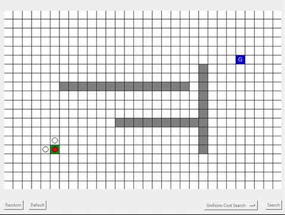

# Motion planning algorithms

This repository contains some implementations of some path planning algorithms.
## Sampling-based Graph Search Algorithms:

[1. Depth-First Search (DFS)]

[2. Uniform Cost Search (UCS)]

[3. Astar (A*)]

 

[4. Probabilistic Roadmap Generation (PRM)]

## Force-based Local Navigation:

[1. 8 Agent Simulation]

[2. Crowd Crossing Simulation]

